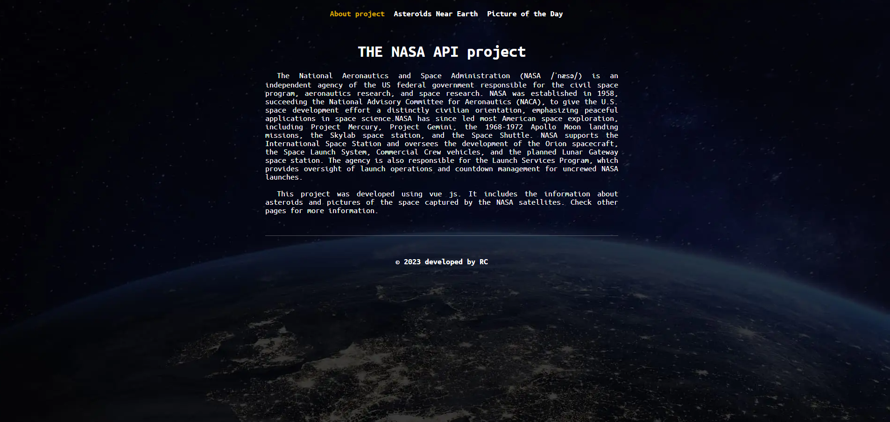
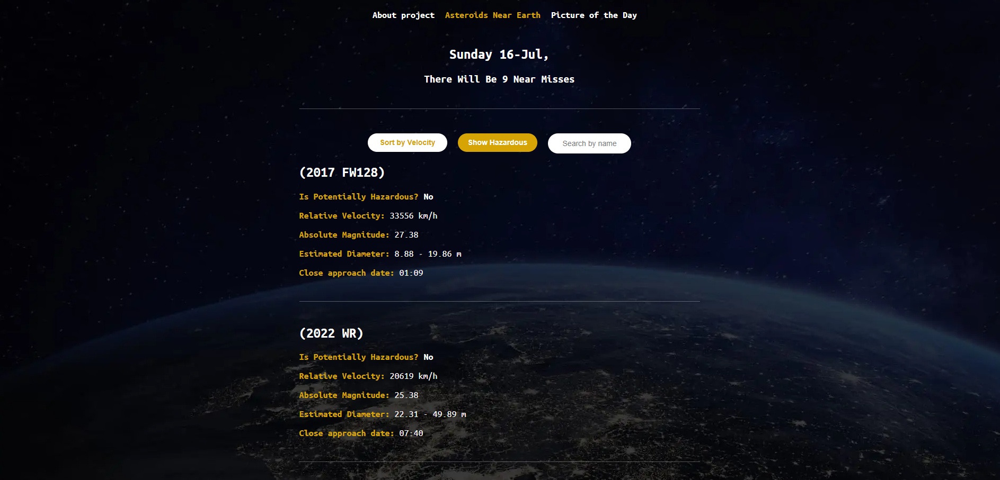
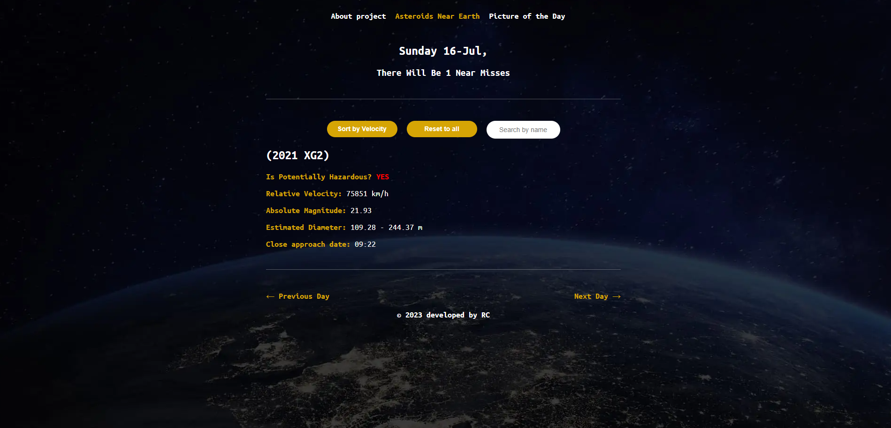
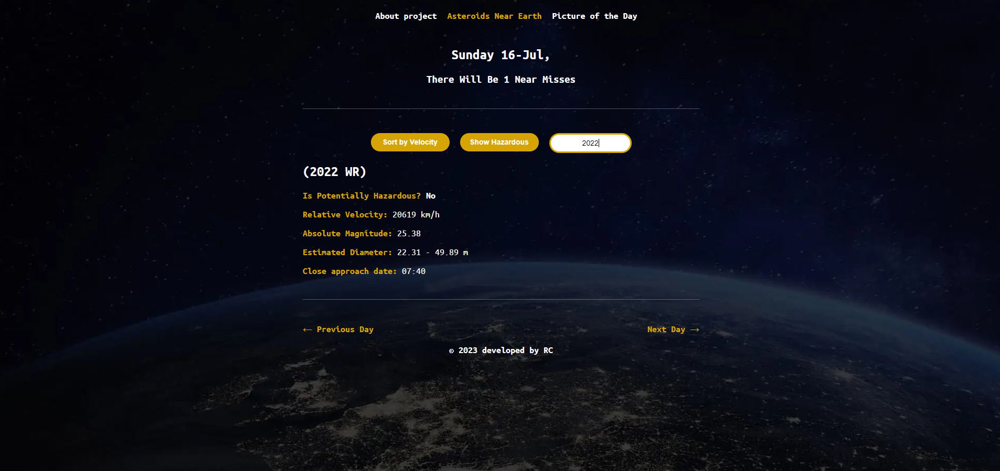
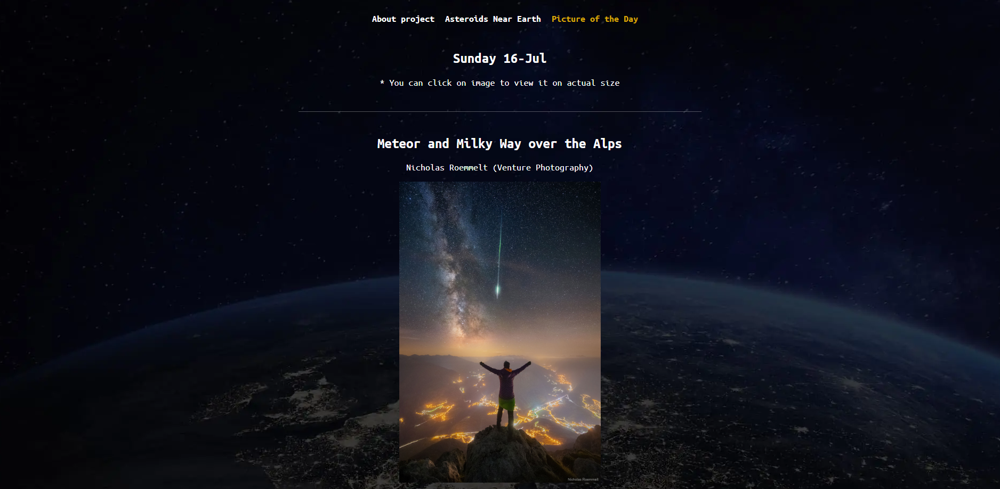

<h1 align="center" id="top">Asteroids App</h1>

<div align="center">
&#xa0;
<a href="https://rahymcharyyev.github.io/asteroids-app/">PRODUCTION</a>
</div>

<p align="center">
  

  

  

  <!--  -->

  <!--  -->

  <!--  -->

  
</p>

<!-- Status -->

<!-- <h4 align="center">
	🚧  Youtube Search 🚀 Under construction...  🚧
</h4>

<hr> -->

<p align="center">
  <a href="#dart-about">About</a> &#xa0; | &#xa0; 
  <a href="#sparkles-features">Features</a> &#xa0; | &#xa0;
  <a href="#rocket-technologies">Technologies</a> &#xa0; | &#xa0;
  <a href="#white_check_mark-requirements">Requirements</a> &#xa0; | &#xa0;
  <a href="#checkered_flag-starting">Starting</a> &#xa0; | &#xa0;
  <a href="#memo-screenshots">Screenshots</a> &#xa0; | &#xa0;
  <a href="#memo-contact">Contacts</a> 
</p>

<br>

## :dart: About

This web application developed with Vue.js and it shows the actual information about asteroids near earth and shows a picture of the day from NASA API (https://api.nasa.gov/)

## :sparkles: Features

:heavy_check_mark: Users can sort the asteroids near Earth by date or by velocity.\
:heavy_check_mark: Users are able to show only hazardous asteroid(s).\
:heavy_check_mark: Functionality to search the asteroid by name.\
:heavy_check_mark: Feature to change the day. You can show asteroids in any day you want.\
:heavy_check_mark: Picture of the day. Ability to show the picture of asteroids of the the day.\

## :rocket: Technologies

The following tools were used in this project:

- [Vue.js](https://ru.vuejs.org/)
- [Axios](https://axios-http.com/docs/intro)
- [Vue-router](https://v3.router.vuejs.org/ru/)
- [Format number](https://github.com/componitable/format-number#readme)

## :white_check_mark: Requirements

Before starting :checkered_flag:, you need to have [Git](https://git-scm.com) and [Node](https://nodejs.org/en/) installed.

## :checkered_flag: Starting

```bash
# Clone this project
$ git clone https://github.com/RahymCharyyev/asteroids-app

# Access
$ cd asteroids-app

# Install dependencies
$ npm install

```

```bash

# Run the project

$ npm run

# The server will initialize in the <http://localhost:4000>

```

## :memo: Screenshots

 \
&#xa0;
 \
&#xa0;
 \
&#xa0;
 \
&#xa0;
 \
&#xa0;

## :memo: Contact

For any inquiries or questions, please contact <a href="https://github.com/RahymCharyyev" target="_blank">Rahym Charyyev</a>

&#xa0;

<a href="#top">Back to top</a>
